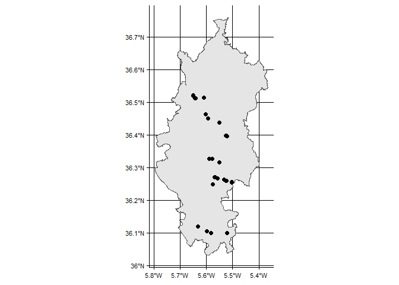
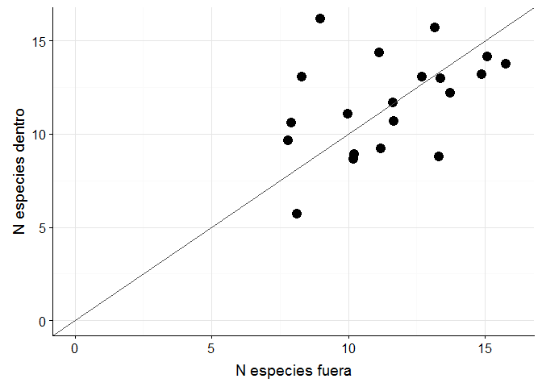
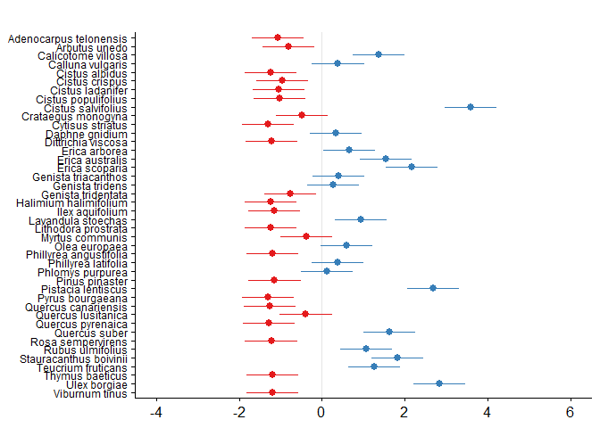

Impactos de la herbivoría por ungulados en las comunidades de plantas leñosas del Parque Natural Los Alcornocales
================
Francisco Rodríguez-Sánchez<sup>1,4</sup>, Virginia Luque-Oliva<sup>1,2</sup>, Vicente Jurado<sup>3</sup>

> 1.  Departamento de Ecología Integrativa, Estación Biológica de Doñana, Consejo Superior de Investigaciones Científicas, Avda. Américo Vespucio 26, 41092 Sevilla, España.

> 1.  Universidad Pablo de Olavide, Ctra. de Utrera s/n, Dos Hermanas, Sevilla, España.

> 1.  Facultad de Geografía e Historia, C/ Doña María de Padilla s/n, 41004 Sevilla, España.

> 1.  Autor para correspondencia \[<frodriguez.work@gmail.com>\]

Resumen
=======

> Las poblaciones de ciervos y otros ungulados se han incrementado enormemente en muchas áreas mediterráneas en las últimas décadas. Los impactos del incremento de la presión de herbivoría en las comunidades de plantas y la eficacia de distintas medidas de conservación están aún poco claras. En este trabajo se evalúan los efectos de la herbivoría en comunidades arbustivas del Campo de Gibraltar y Parque Natural de Los Alcornocales. Se ha comparado la diversidad de plantas, la cobertura, la altura y la intensidad de daños dentro y fuera de un total de 20 cercados de exclusión de herbívoros establecidos hace 10-15 años para favorecer la regeneración del bosque. Aunque la composición de la comunidad de plantas (riqueza de especies y diversidad) fue similar en las zonas cercadas y no cercadas, la altura de los arbustos y su cobertura fueron mayores dentro de los cercados de protección. En contraste, el daño de herbivoría fue mucho mayor en las áreas no cercadas, particularmente en aquellas plantas de etapas sucesionales tardías y más palatables. Aunque la mayoría de las especies son de larga vida y muy resilientes, la sobrepoblación de herbívoros mantenida en el tiempo puede comprometer su reproducción y persistencia a largo plazo. De este modo, la sobrepoblación de ciervos está moldeando la estructura de las comunidades arbustivas mediterráneas, reduciendo su densidad y seleccionando aquellas plantas más tolerantes a la perturbación y el ramoneo frente a aquellas de etapas sucesionales más tardías.

Abstract
========

> Deer have overpopulated many Mediterranean areas in recent decades. The likely impacts of the increased herbivory pressure on Mediterranean plant communities are, however, unclear. Here we assess the community-wide effects of deer browsing in shrublands of Los Alcornocales Natural Park (southern Spain). We compared plant species diversity, cover, height, and damage intensity within and outside of deer exclosures established 10-15 years ago to promote natural regeneration of the forest. Although community composition (species richness and diversity) was similar in fenced and non-fenced areas, shrub height and cover were higher within fenced areas. In contrast, browsing damage was much higher in open areas, particularly for late-successional, highly palatable species. Although most plant species were long-lived and highly resilient, sustained overbrowsing might compromise reproduction and long-term persistence in the landscape. Thus, deer overpopulation is shaping the structure of these Mediterranean shrublands, reducing shrub density and selecting against shade-tolerant species, hence delaying succession.

Palabras clave
==============

> sobrepoblación de ciervos, herbivoría, cercados de exclusión, vegetación, regeneración natural, alcornocales, Mediterráneo

Keywords
========

> deer overpopulation, deer browsing, herbivory, exclosures, plant communities, vegetation, natural regeneration, cork oak forests, Mediterranean

``` r
library(knitcitations)
cleanbib()   
cite_options(citation_format = "pandoc")
```

Introducción
============

Las poblaciones de grandes ungulados herbívoros han sufrido una explosión demográfica en muchas partes del mundo. También en el Parque Natural Los Alcornocales (Cádiz-Málaga), incluyendo la comarca del Campo de Gibraltar, al sur de la Península Ibérica. El Plan de Caza del Área Cinegética Alcornocales (2012) recoge densidades de población de entre 4 y 32 individuos por kilómetro cuadrado en el caso del ciervo (*Cervus elaphus*), entre 6 y 21 ejemplares/km<sup>2</sup> de muflón (*Ovis aries*), entre 4 y 12 individuos/km<sup>2</sup> de gamo (*Dama dama*), y de 0.2 a 15 ejemplares de corzo (*Capreolus capreolus*), a las que habría que sumar el ganado doméstico (principalmente vacuno) en determinados puntos. Estas densidades se encuentran muy por encima de las recomendadas (Montoya, 1998, CMAOT (2017)).

De estas especies, las poblaciones de corzo parecen ser las únicas de origen nativo en la comarca, diferenciándose ecológica, morfológica y genéticamente de otras subespecies de corzo europeo (San José, 2013). Aunque existen evidencias de la presencia de ciervo y gamo en tiempos históricos en la provincia de Cádiz, las poblaciones actuales de estas especies (ciervo, gamo, muflón) provienen de múltiples eventos recientes de introducción intencionada por parte del hombre a lo largo del siglo XX (Sánchez Vela, 2015). Ante la ausencia de depredadores naturales como el lobo (*Canis lupus*), extinguido totalmente en la comarca en el primer tercio del siglo XX tras una intensa persecución humana, las poblaciones de ungulados (principalmente de ciervo, gamo y muflón, pero también de jabalí y cerdo asilvestrado) experimentaron un crecimiento drástico con claros síntomas de sobrepoblación, incluyendo episodios recurrentes de mortandades masivas por epizootias en las últimas décadas (CMAOT, 2017). La expansión principalmente del ciervo perjudicó de manera notable al corzo, cuyas densidades guardan una correlación negativa con la densidad de ciervo, ante el que es desplazado de manera competitiva.

Desde hace tiempo se vienen igualmente acumulando evidencias del impacto que la sobreabundancia de estos ungulados está teniendo sobre la vegetación y la regeneración natural de muchas especies de plantas a lo largo y ancho del Parque Natural. Como animales herbívoros, su alimentación combina en diferentes proporciones plantas herbáceas y leñosas, como el alcornoque (*Quercus suber*), el acebuche (*Olea europaea*), el lentisco (*Pistacia lentiscus*), el agracejo y el labiérnago (*Phyllirea spp.*), los brezos (*Erica spp.*) y algunas cistáceas (*Cistus spp.*), entre otras. La falta de regeneración natural, combinada a la elevada mortalidad por seca, está llevando a la desaparición paulatina del alcornocal en muchos montes del Parque Natural (Ibáñez et al., 2017).

Consciente de este problema, la Consejería de Medio Ambiente y Ordenación del Territorio de la Junta de Andalucía puso en marcha una serie de medidas orientadas al control cinegético de las poblaciones de ciervo, gamo, muflón y cerdo asilvestrado, y a impulsar la regeneración natural del bosque. Además de intensificar la presión cinegética para intentar reducir las densidades de herbívoros, desde los años 90 se han llevado a cabo múltiples actuaciones de reforestación y fomento de la regeneración en miles de hectáreas de montes públicos. Estas actuaciones, con un coste total de decenas de millones de euros, incluyeron la siembra extensiva de bellotas de alcornoque, la plantación con plantones producidos en vivero, y la instalación de cientos de cercados de exclusión de grandes herbívoros. Estos cerramientos, con una superficie media de 50 hectáreas y protegidos mediante malla cinegética, ocupan en la actualidad más de 7.500 hectáreas, aproximadamente el 30% de la superficie de montes públicos dentro del Parque Natural (CMAOT, 2017).

A pesar de la enorme inversión de millones de euros, existen pocos datos cuantitativos de la eficacia de estas medidas para fomentar la regeneración natural del bosque (Rodríguez-Sánchez, 2002; Rodríguez-Sánchez y Arroyo, 2004). Las evidencias disponibles indican que muchas repoblaciones fracasaron ante el uso de bellota en mal estado, plantones de vivero poco endurecidos y con escaso desarrollo radical y, sobre todo, las elevadas densidades de herbívoros. Los tubos protectores se mostraron ineficaces e incluso contraproducentes para proteger de la herbivoría. En cuanto a los cerramientos, las experiencias descritas para el monte público de La Teja (Sánchez-Vela et al., 2004), así como otros montes públicos de Los Barrios (Gaspe et al., 2017), indican un notable éxito en la regeneración natural, particularmente del alcornoque. Pero La Teja es un caso particular donde se puso especial vigilancia como experimento para medir las ventajas de la exclusión de herbívoros. Faltan evidencias de muchísimos otros cerramientos, distribuidos también por otras zonas del Parque Natural, así como de los efectos sobre el conjunto de la vegetación (esto es, resto de especies más allá del alcornoque).

En este trabajo analizamos la eficacia de los cercados de exclusión para promover la regeneración natural así como el impacto de la sobreabundancia de grandes herbívoros sobre las comunidades de plantas leñosas del Parque Natural Los Alcornocales.

Métodos
=======

Área de estudio
---------------

El Parque Natural de los Alcornocales fue establecido en 1989 para promover la conservación de la biodiversidad y el manejo forestal sostenible. Entre otras características, el parque destaca por albergar los bosques de alcornoque (*Quercus suber*) más extensos y mejor conservados de la Península Ibérica (Blanco et al., 1998; Coca Pérez, 2007). Éstos se extienden sobre los suelos ácidos y pobres en nutrientes de arenisca que dominan el parque. El alcornoque es reemplazado por el semi-deciduo *Quercus canariensis* en elevaciones más altas y áreas más húmedas, como en los márgenes de los arroyos. Los bosques ribereños, conocidos localmente como *canutos*, son muy diversos y contienen varias especies relictas muy antiguas como *Rhododendron ponticum*, *Laurus nobilis*, *Ilex aquifolium* y *Frangula alnus* además de helechos singulares. Las cumbres suelen estar cubiertas por brezales ricos en endemismos leñosos (Ojeda et al., 1996), ocasionalmente intercalados con parches de *Quercus pyrenaica* por encima de 900 m de altitud. Los suelos calcáreos (básicos), raros pero más abundantes en elevaciones bajas, son ocupados por *Olea europaea* y otras especies termo-mediterráneas como *Pistacia lentiscus* y *Myrtus communis* (y ocasionalmente *Quercus ilex*).

El clima es de tipo mediterráneo con influencia oceánica, caracterizado por inviernos frescos y húmedos y veranos cálidos y secos. La precipitación media anual es de aproximadamente 620 mm (llegándose a triplicar en las cotas más altas) y la temperatura media anual es de 15,7 ºC. La actividad humana más importante en el parque es la extracción de corcho, que se practica tradicionalmente cada 9 años. La ganadería y la caza mayor (principalmente de ciervo y corzo) son también recursos socioeconómicos muy importantes en el parque.

Recolección de datos en campo
-----------------------------

Para analizar el posible impacto de los herbívoros sobre la vegetación (presencia y abundancia de especies leñosas), y el efecto de los cercados de exclusión, muestreamos entre 2015 y 2016 un total de 20 sitios distribuidos por todo el Parque Natural (Tabla 1, Fig. 1). Para este estudio nos centramos exclusivamente en cercados en buen estado de funcionamiento: buen estado de la malla de protección y sin evidencias de presencia de herbívoros. Durante el trabajo de campo tuvimos que descartar muchos cercados por no cumplir estas condiciones. Todos los cerramientos llevaban más de 10 años en funcionamiento.

En cada sitio anotamos la altura media del matorral y medimos la cobertura de cada especie de planta a lo largo de transectos lineales de 50 metros de longitud. En cada sitio realizamos un transecto dentro del cercado y otro fuera del mismo, a modo de control, a 10 metros aproximadamente de la malla, asegurándonos de que ambos transectos presentasen condiciones ambientales similares con respecto al tipo de hábitat, la altitud o la pendiente.

Además de la presencia y abundancia de especies, utilizamos la escala semi-cuantitativa de Montoya (1998) (Tabla 2) para registrar el daño por herbivoría en cada especie dentro y fuera del cerramiento.

Análisis de datos
-----------------

``` r
library(dplyr)
library(exclosures)

dataset <- readr::read_csv(file.path(root, "data", "fulldata.csv"))
dataset <- dataset %>%
  filter(shrub_tree == "shrub") %>%
  filter(species != "Ceratonia siliqua") %>%  # always missing
  mutate(inside = ifelse(inside == 1, "in", "out"))
dataset$inside <- relevel(as.factor(dataset$inside), ref = "out")
dataset$zinside <- dataset$inside

dataset$species <- factor(dataset$species, levels = rev(sort(unique(dataset$species)))) # to order labels in ggplot

# logit transformation
abudata <- dataset %>%
  #filter(cover > 0) %>%  # select only species present
  #mutate(cover = ifelse(cover == 0, 0.01, cover)) %>%
  mutate(cover = cover + 0.01) %>%
  mutate(cover = ifelse(cover == 50, 49.9, cover)) %>%
  mutate(logitcover = arm::logit(cover/50))

nobare <- filter(abudata, species != "bare")
bare <- filter(abudata, species == "bare")
```

Para el análisis de la presencia/ausencia de especies en cada transecto, utilizamos un modelo mixto lineal generalizado (GLMM) con distribución binomial y enlace logit:

*logit(Presencia<sub>ij</sub>)=α + β \ Dentro<sub>ij</sub> + γ<sub>i</sub> + δ<sub>j</sub>*

donde la presencia de la especie *i* en el transecto *j* depende de un intercepto general (*α*) que representa la probabilidad media de presencia de cualquier especie fuera de los cercados (prevalencia), el efecto (*β*) que encapsula la diferencia en probabilidad de presencia dentro de los cercados, y dos efectos aleatorios para absorber la variación en probabilidades de presencia entre especies (*γ*) y sitios (*δ*).

``` r
library(lme4)
library(arm)
library(sjPlot)
library(ggplot2)
library(cowplot)


presabs.model <- glmer(presence ~ 1 + zinside + (1 + zinside | species) + (1 | site), 
                               data = nobare, family = "binomial")
#arm::display(presabs.model)

# plot_model(presabs.model, type = "re", ri.nr = 1, transform = NULL, 
#                         grid = TRUE, title = "Probabilidad de presencia (escala logit)",
#                         axis.lim = c(-4, 4), ci.lvl = 0.95) 
```

Para analizar la abundancia de especies (cobertura lineal), utilizamos un modelo lineal mixto con la misma estructura de predictores pero distribución gaussiana, tras normalizar los datos de cobertura con una transformación logit (Warton y Hui, 2011):

*logit(Cobertura<sub>ij</sub>)=α + β \ Dentro<sub>ij</sub> + γ<sub>i</sub> + δ<sub>j</sub>*

``` r
bare.model <- lmer(logitcover ~ 1 + zinside + (1 |site), data = bare)
# arm::display(bare.model)
# invlogit(fixef(bare.model)[1]) # bare cover outside
# invlogit(fixef(bare.model)[1] + fixef(bare.model)[2]) # bare cover inside
```

``` r
#kable(nobare %>% group_by(species, zinside) %>% summarise(mean(cover)))

abuspp.model <- lmer(logitcover ~ 1 + zinside + (1 + zinside |species) + (1 |site), 
                               data = nobare)
#arm::display(abuspp.model)
```

Para analizar si las plantas dentro del cerramiento tenían efectivamente menos daños por ramoneo de los herbívoros, modelamos el daño observado (siguiendo la categoría semicuantitativa de Montoya (1998)) utilizando un modelo mixto con distribución de Poisson:

*log(Daño<sub>ij</sub>)=α + β \ Dentro<sub>ij</sub> + γ<sub>i</sub> + δ<sub>j</sub>*

``` r
damagemodel <- glmer(damage ~ 1 + zinside + (1 + zinside | species) + (1|site), 
                     data = nobare, family = "poisson")
# arm::display(damagemodel)
# coef(damagemodel)
# summary(allEffects(damagemodel))
# 
# plot_model(damagemodel, type = "re", transform = NULL)
```

Para todos estos análisis empleamos el programa estadístico `R` (R Core Team, 2018) y los paquetes `readr` (Wickham et al., 2017), `dplyr` (Wickham et al., 2018), `vegetools` (Rodriguez-Sanchez, 2018), `lme4` (Bates et al., 2015), `ggplot2` (Wickham, 2016), `sjPlot` (Lüdecke, 2018), `exclosures` (Rodriguez-Sanchez y Luque, 2018), y `knitr` (Xie, 2014, 2015, 2018). El trabajo se escribió en Rmarkdown, y tanto los datos como el código empleados se encuentran disponibles en <https://github.com/Pakillo/exclosures-Almoraima>.

Resultados
==========

``` r
height <- lmer(shrub_height ~ inside + (1 | site), data = dataset)
#arm::display(height)
```

La altura media del matorral fue casi el doble dentro de los cerramientos que fuera de ellos (Fig. 2). Además, el grado de cobertura del matorral fue también superior (75% frente a 64% dentro y fuera de los cercados, Fig. 3). En otras palabras, fuera de los cercados hay más suelo desnudo, desprovisto de vegetación leñosa.

En total registramos 42 especies de plantas leñosas. El número de especies por transecto estuvo en torno a 11-12, sin que se encontraran diferencias destacables en riqueza de especies dentro y fuera de los cerramientos (Fig. 4).

La mayoría de las especies son raras, apareciendo sólo en alguno de los sitios estudiados. El análisis de la probabilidad de presencia dentro y fuera de cercados (Fig. 5) muestra aquellas especies con alta prevalencia (presentes en un gran número de sitios) como *Cistus salvifolius*, *Pistacia lentiscus*, *Olea europaea*, *Ulex borgiae*, *Calicotome villosa*, *Quercus suber*, *Lavandula stoechas*, *Stauracanthus boivinii*, *Teucrium fruticans*, *Erica australis* y *Erica scoparia*. La mayoría de las especies mostraron una tendencia leve a aumentar su probabilidad de presencia dentro de los cercados, salvo algunas como *C. salvifolius*, *U. borgiae*, *P. lentiscus*, *Q. suber* o *S. boivinii* (Fig. 5).

Igualmente, la mayoría de las especies ocupan poca cobertura (menos del 10%) dentro del sotobosque de alcornocal. Nuevamente las especies más abundantes son *C. salvifolius*, *P. lentiscus*, *U. borgiae*, o *E. scoparia* (Fig. 6), y aunque los cerramientos tuvieron un ligero efecto positivo sobre la cobertura, para muchas especies no se observaron diferencias consistentes en la cobertura dentro y fuera de los cerramientos (Fig. 7). Los incrementos más marcados de cobertura dentro de los cercados se dieron en *E. scoparia*, *A. unedo*, *Q. suber*, *L. stoechas* o *P. latifolia*.

En la intensidad de daños por ramoneo fue donde sin duda más se notaron los efectos de la exclusión de herbívoros. Mientras que las especies más palatables (*O. europaea*, *P. angustifolia*, *P. latifolia*, *Q. suber*) se encuentran consistentemente recomidas fuera de los cercados (Fig. 8), llegando incluso a no tener más material consumible (nivel 5 en la escala de Montoya (1998)), todas las especies se beneficiaron de la protección del cercado, mostrando niveles de herbivoría consistentemente más bajos dentro del cerramiento (Fig. 9). En algunos casos (p. ej. *Q. suber*) esta diferencia llega a ser tal que las plantas fuera de cercados presentan niveles de herbivoría 4-5 (totalmente recomidas) mientras que dentro de los cercados los brinzales crecen intactos o con escasas mordeduras.

Discusión
=========

Nuestro trabajo aporta evidencias inéditas sobre el impacto que la sobreabundancia de grandes herbívoros está teniendo sobre las comunidades de plantas del Parque Natural Los Alcornocales, así como la eficacia de los cerramientos de exclusión para favorecer la regeneración natural del bosque. Nuestros resultados demuestran que la excesiva presión de herbivoría está causando sotobosques de menor altura y menos densos, con más suelo desnudo y por tanto más vulnerables a la erosión.

Aunque las diferencias en abundancia (cobertura) de las especies dentro y fuera de los cerramientos fueron moderadas, nuestros datos indican que un gran número de especies (sobre todo las más palatables) se encuentran expuestas a presiones de herbivoría excesivas. Los indicadores de daños por ramoneo muestran niveles muy elevados para varias especies, que impiden el normal desarrollo y actividad de las plantas.

La inmensa mayoría de las especies mediterráneas como las estudiadas aquí están adaptadas a cierta presión de herbivoría, ya sea por la presencia de estrategias defensivas (p.ej. espinas, toxicidad) o la resiliencia frente al ramoneo. Esta adaptación al ramoneo explica probablemente que la cobertura de las especies no se resienta demasiado a pesar de la presión a que están sometidas. Son especies por lo general bastante resistentes, que pueden persistir durante años sin apenas crecimiento vegetativo.

Sin embargo, la excesiva presión herbívora sostenida durante muchos años puede tener efectos notables sobre la sucesión y las estructuras de las comunidades de plantas. Nuestros resultados indican que en terrenos desprotegidos el sotobosque es más ralo, menos denso, lo cual puede estar asociado con mayor insolación, mayores temperaturas y en general menor protección de la regeneración natural del bosque. En zonas muy ramoneadas, la producción de frutos y semillas necesarias para la regeneración natural es prácticamente inexistente. Aunque la resistencia de las especies impide su extinción local inmediata, la comunidad se encuentra en un estado de 'sucesión suspendida', donde las especies ombrófilas propias de estadios sucesionales más avanzados, y aquellas menos protegidas frente a la herbivoría, se ven sistemáticamente desfavorecidas.

Nuestros resultados también muestran que los cerramientos de exclusión de herbívoros pueden ser, en algunos casos, eficaces para favorecer la regeneración del bosque (incluyendo el alcornoque y sus especies acompañantes). No obstante, no está claro que, dado su enorme coste de instalación y mantenimiento e impacto ecológico, sea recomendable su uso extensivo. Debemos destacar que este estudio, al igual que otros publicados (Sánchez-Vela et al., 2004) se ha centrado en veinte cerramientos con circunstancias especiales en cuanto a mantenimiento de la malla, vigilancia de la entrada de animales, etc. De los cientos de cercados distribuidos por el Parque Natural, estos son un subconjunto especial con un buen funcionamiento superior a la media. En ausencia de vigilancia y mantenimiento tras su instalación, muchos cerramientos se vuelven totalmente inútiles por rotura de la malla cinegética, caída de árboles o entrada de animales, con lo que la inversión económica inicial no produce el beneficio ecológico esperado en muchos casos. Dado el perímetro de muchos cerramientos, la vigilancia y el mantenimiento resultan especialmente costosos, pero necesarios si queremos asegurar su eficacia.

Por tanto, aunque pueda recomendarse el uso de cercados en situaciones puntuales, resulta imprescindible mantener el objetivo claro de reducir las densidades de ungulados de manera conjunta en todo el Parque Natural, para evitar los problemas derivados de su sobrepoblación sobre la vegetación.

Agradecimientos
===============

Este proyecto estuvo financiado por una ayuda postdoctoral del Ministerio de Economía y Competitividad a F.R.S. (FPD2013-16756). Queremos agradecer públicamente la ayuda y la colaboración de Juan Manuel Fornell, Eduardo Briones, Pedro Jordano, Rafael Sánchez, Alfonso Pantoja, y de todos los guardas y agentes de medio ambiente que cuidan el monte.

###### REFERENCIAS

Bates, D., Mächler, M., Bolker, B., Walker, S. 2015. Fitting Linear Mixed-Effects Models Using lme4. *Journal of Statistical Software* 67: 1-48.

Blanco, E., Casado, M.A., Costa, M., Escribano, R., García, M., Génova, M., Gomez, A. et al. 1998. *Los bosques ibéricos*. Geoplaneta., Barcelona.

CMAOT. 2017. Decreto 150/2017 de 19 de septiembre por el que se aprueba el Plan de Ordenación de los Recursos Naturales del ámbito Los Alcornocales. *BOJA* 194:.

Coca Pérez, M. 2007. Diversity in the cork oak forests of the northern Straits of Gibraltar Region (Southern Spain). *Plant Ecology* 189: 87-100.

Gaspe, M., Zamora, R., Briones, E. 2017. Evaluación de la regeneración del monte alcornocal bajo cercados cinegéticos. *Almoraima* 47: 73-84.

Ibáñez, B., Gómez-Aparicio, L., Ávila, J.M., Pérez-Ramos, I.M., Marañón, T. 2017. Effects of Quercus suber Decline on Woody Plant Regeneration: Potential Implications for Successional Dynamics in Mediterranean Forests. *Ecosystems* 20: 630-644.

Lüdecke, D. 2018. *sjPlot: Data Visualization for Statistics in Social Science*.

Montoya, J.M. 1998. *El ciervo y el monte*. Fundación Conde del Valle de Salazar - Mundiprensa, Madrid.

Ojeda, F., Marañón, T., Arroyo, J. 1996. Patterns of Ecological, Chorological and Taxonomic Diversity at Both Sides of the Strait of Gibraltar. *Journal of Vegetation Science* 7: 63-72.

R Core Team. 2018. *R: A Language and Environment for Statistical Computing*. R Foundation for Statistical Computing, Vienna, Austria.

Rodriguez-Sanchez, F. 2018. *vegetools: Tools for vegetation analysis*.

Rodriguez-Sanchez, F., Luque, V. 2018. *exclosures: Analysis of the impacts of deer overpopulation in forest understoreys of Los Alcornocales Natural Park (southern Spain)*.

Rodríguez-Sánchez, F. 2002. *Diseño de restauraciones con especies de árboles y arbustos de interés ecológico en el Parque Natural Los Alcornocales*. (informe inédito).

Rodríguez-Sánchez, F., Arroyo, J. 2004. La necesidad de la experimentación en Ecología y conservación: una aproximación para la restauración forestal en el Parque Natural Los Alcornocales. *Almoraima* 31: 137-144.

San José, C. 2013. Conservación y gestión cinegética del corzo en Andalucía. *Revista Ecosistemas* 22: 20-26.

Sánchez Vela, R. 2015. Evolución histórica de las poblaciones de mamíferos en el Parque Natural Los Alcornocales. En *Jornadas sobre Manejo y Conservación de Alcornocales*, Algeciras.

Sánchez-Vela, R.J., Muñoz, A., Briones, E. 2004. Soluciones al fenómeno de «la seca» en el Parque Natural Los Alcornocales: «La Teja» (Los Barrios), un modelo a seguir. *Almoraima* 31: 159-168.

Warton, D.I., Hui, F.K.C. 2011. The arcsine is asinine: The analysis of proportions in ecology. *Ecology* 92: 3-10.

Wickham, H. 2016. *ggplot2: Elegant Graphics for Data Analysis*. Springer-Verlag New York.

Wickham, H., François, R., Henry, L., Müller, K. 2018. *dplyr: A Grammar of Data Manipulation*.

Wickham, H., Hester, J., Francois, R. 2017. *readr: Read Rectangular Text Data*.

Xie, Y. 2015. *Dynamic Documents with R and knitr*. 2nd ed. Chapman; Hall/CRC, Boca Raton, Florida.

Xie, Y. 2014. knitr: A Comprehensive Tool for Reproducible Research in R. En Stodden, V., Leisch, F., Peng, R. D. (eds.), *Implementing Reproducible Computational Research*, Chapman; Hall/CRC.

Xie, Y. 2018. *knitr: A General-Purpose Package for Dynamic Report Generation in R*.

###### TABLA 1

**Tabla 1**. Localización de los 20 cercados de exclusión de herbívoros incluidos en este estudio.

``` r
sites <- readr::read_csv(file.path(root, "data", "sites_info.csv")) %>%
  dplyr::select(town, site, lat, long, altitude) %>%
  dplyr::distinct(site, .keep_all = TRUE) %>%
  mutate(town = case_when(
    town == "Alcala" ~ "Alcalá de los Gazules",
    town == "Los_Barrios" ~ "Los Barrios",
    town == "Jerez" ~ "Jerez de la Frontera", 
    town == "Jimena" ~ "Jimena de la Frontera",
    town == "Tarifa" ~ "Tarifa"
  )) %>%
  mutate(lat = round(lat, digits = 2),
         long = round(long, digits = 2)) %>%
  arrange(town, site)
kable(sites, col.names = c("Municipio", "Cercado", "Latitud", "Longitud", "Altitud"))
```

| Municipio             | Cercado           |  Latitud|  Longitud|  Altitud|
|:----------------------|:------------------|--------:|---------:|--------:|
| Alcalá de los Gazules | Barrancones       |    36.46|     -5.60|      422|
| Alcalá de los Gazules | Hernan\_Martin    |    36.51|     -5.64|      523|
| Alcalá de los Gazules | Laguna\_Picacho   |    36.52|     -5.65|      394|
| Alcalá de los Gazules | Laurel            |    36.45|     -5.59|      408|
| Jerez de la Frontera  | Aljibe            |    36.51|     -5.61|     1039|
| Jimena de la Frontera | Garganta\_Honda   |    36.40|     -5.52|      485|
| Jimena de la Frontera | Gavilanes         |    36.44|     -5.55|      469|
| Jimena de la Frontera | Las\_Naranjas     |    36.40|     -5.52|      451|
| Los Barrios           | Beatas1           |    36.32|     -5.55|      287|
| Los Barrios           | Cucarretes1       |    36.26|     -5.52|      270|
| Los Barrios           | Cucarretes2       |    36.26|     -5.53|      280|
| Los Barrios           | Cuevas\_Hospital2 |    36.25|     -5.50|      267|
| Los Barrios           | Faldas\_Rubio1    |    36.33|     -5.59|      291|
| Los Barrios           | Faldas\_Rubio2    |    36.33|     -5.58|      306|
| Los Barrios           | Mogea\_Luenga2    |    36.27|     -5.56|      250|
| Los Barrios           | Palancar          |    36.25|     -5.57|      191|
| Los Barrios           | Teja1             |    36.27|     -5.57|      261|
| Tarifa                | Caheruelas4       |    36.10|     -5.60|      273|
| Tarifa                | Caheruelas5       |    36.10|     -5.58|      282|
| Tarifa                | Puertollano       |    36.12|     -5.63|      169|

###### TABLA 2

**Tabla 2**. Escala semi-cuantitativa para evaluar los daños por ramoneo y la presión de herbivoría, Montoya (1998).

``` r
table2 <- data.frame(value = seq(0, 5, by = 1),
                     damage = c("Intacta", "Mordeduras poco aparentes", 
                                "Mordeduras evidentes pero no relevantes", 
                                "Herbivoría normal", 
                                "Recomida", 
                                "Sin verde accesible"))
kable(table2, col.names = c("Valor", "Intensidad de herbivoría"))
```

|  Valor| Intensidad de herbivoría                |
|------:|:----------------------------------------|
|      0| Intacta                                 |
|      1| Mordeduras poco aparentes               |
|      2| Mordeduras evidentes pero no relevantes |
|      3| Herbivoría normal                       |
|      4| Recomida                                |
|      5| Sin verde accesible                     |

###### PIES DE FIGURA

**Figura 1**. Mapa con la ubicación de los 20 cercados estudiados.

**Figura 2**. Altura media del matorral dentro y fuera de los cerramientos para cada uno de los 20 sitios estudiados. La línea muestra la isolínea de alturas, donde la altura es idéntica dentro y fuera del cercado. Cuando los puntos caen por encima de la línea, la altura es mayor dentro del cercado.

**Figura 3**. Cobertura de matorral dentro y fuera de los cerramientos para cada uno de los 20 sitios estudiados. La línea muestra la isolínea donde la cobertura es idéntica dentro y fuera del cercado. Cuando los puntos caen por encima de la línea (casi todos los casos), la cobertura es mayor dentro del cercado.

**Figura 4**. Número de especies registradas en cada transecto de 50 metros realizado dentro y fuera de los 20 cerramientos.

**Figura 5**. A) Probabilidad de presencia (escala logit) de cada especie fuera de los cerramientos. Las especies con valores por encima de 0 están más extendidas (mayor prevalencia), mientras que los valores negativos indican especies raras. B) Diferencias interespecíficas en el efecto de los cercados sobre la probabilidad de presencia. Aunque el efecto del cerramiento fue levemente positivo, algunas especies se ven más favorecidas (valores por encima de cero) que otras (valores negativos).

**Figura 6**. Abundancia media (cobertura lineal, en escala logit) de cada especie fuera de los cerramientos. Las especies con valores por encima de 0 son más abundantes, mientras que los valores negativos indican especies más raras.

**Figura 7**. Cobertura observada de cada especie dentro y fuera de los cerramientos. La línea muestra en cada caso la isolínea donde la cobertura es idéntica dentro y fuera del cercado. Cuando los puntos caen por encima de la línea, la cobertura es mayor dentro del cercado, y vice versa. Sólo se muestran aquellas especies presentes en al menos 4 sitios.

**Figura 8**. A) Diferencias interespecíficas en la intensidad de daños por ramoneo fuera de los cerramientos (escala logarítmica). Las especies con valores más positivos sufren mayor presión de herbivoría. B) Diferencias interespecíficas en el efecto del cercado sobre los daños por ramoneo (escala logarítmica).

**Figura 9**. Daños por ramoneo observados para cada especie dentro y fuera de los cerramientos (escala de Montoya 1998, Tabla 2). Las líneas muestran la isolínea de igual daño dentro y fuera del cercado. Los puntos por debajo de la línea indican que los daños son menores dentro del cercado. Sólo se muestran aquellas especies presentes en al menos 5 sitios.

###### FIGURA 1

``` r
library(sf)

sites <- readr::read_csv(file.path(root, "data", "sites_info.csv"))
occs <- st_as_sf(sites, coords = c("long", "lat"), crs = "+init=EPSG:4326")

lim.pn <- st_read(file.path(root, "data", "limite pn.shp"), crs = "+init=EPSG:23030", quiet = TRUE)
lim.pn.geo <- st_transform(lim.pn, crs = "+init=EPSG:4326")

map <- ggplot() + #coord_map() +
  geom_sf(data = lim.pn.geo) +
  geom_sf(data = occs, size = 2) +
  theme(axis.text = element_text(size = 8)) +
  # theme(panel.grid.major = element_line(colour = 'transparent'), # remove graticule
  #       panel.grid.minor = element_line(colour = 'transparent')) +
  # geom_text_repel(data = dplyr::distinct(sites, site, .keep_all = TRUE), # add site names
  #                 aes(x = long, y = lat, label = site), size = 4) +
  NULL


map
```



``` r
ggplot2::ggsave(file.path(root, "manuscript", "Fig1.tif"), map, 
                device = "tiff", width = 6, height = 6, units = "in", dpi = 300, 
                compression = "lzw")
```

###### FIGURA 2

``` r
height <- scatter_inout(dataset, vble = "height", fontsize = 14, psize = 4, jitter = FALSE,
                            xlab = "Altura matorral fuera (m)", ylab = "Altura matorral dentro (m)")
```


``` r
ggplot2::ggsave(file.path(root, "manuscript", "Fig2.tif"), height, 
       device = "tiff", width = 6, height = 5, units = "in", dpi = 300, compression = "lzw")
```

###### FIGURA 3

``` r
plantcover <- scatter_inout(dataset, vble = "cover", fontsize = 14, psize = 4, jitter = TRUE,
                     xlab = "Cobertura fuera (%)", ylab = "Cobertura dentro (%)")
```


``` r
ggplot2::ggsave(file.path(root, "manuscript", "Fig3.tif"), plantcover, 
       device = "tiff", width = 6, height = 5, units = "in", dpi = 300, compression = "lzw")
```

###### FIGURA 4

``` r
nsp <- scatter_inout(dataset, vble = "nspp", fontsize = 14, psize = 4, jitter = TRUE,
                     xlab = "N especies fuera", ylab = "N especies dentro")
```



``` r
ggplot2::ggsave(file.path(root, "manuscript", "Fig4.tif"), nsp, 
       device = "tiff", width = 6, height = 5, units = "in", dpi = 300, compression = "lzw")
```

###### FIGURA 5

``` r
ggm <- sjPlot::plot_model(presabs.model, type = "re", ri.nr = 1, transform = NULL, 
                        grid = FALSE)
ggout <- ggm[[1]] + 
  #labs(title = "Probabilidad de presencia fuera de cercados") + 
  labs(title = "") +
  theme(axis.text.y = element_text(size = 9))
ggin <- ggm[[2]] + 
  #labs(title = "Diferencias interespecíficas en el efecto de los cercados sobre la probabilidad de presencia") + 
  labs(title = "") +
  theme(axis.text.y = element_text(size = 9))

fig <- cowplot::plot_grid(ggout, ggin, nrow = 1, labels = "AUTO") 
fig
```


``` r
ggplot2::ggsave(file.path(root, "manuscript", "Fig5.tif"), fig, 
       device = "tiff", width = 6, height = 7, units = "in", dpi = 300, compression = "lzw")
```

###### FIGURA 6

``` r
ggm <- sjPlot::plot_model(abuspp.model, type = "re", ri.nr = 1, transform = NULL, 
                        grid = FALSE)
ggout <- ggm[[1]] + 
  labs(title = "") + 
  theme(axis.text.y = element_text(size = 9))
ggout
```



``` r
# ggin <- ggm[[2]] + 
#   labs(title = "") + 
#   theme(axis.text.y = element_text(size = 9))
# 
# fig <- cowplot::plot_grid(ggout, ggin, nrow = 1, labels = "AUTO") 
# fig

ggplot2::ggsave(file.path(root, "manuscript", "Fig6.tif"), ggout, 
       device = "tiff", width = 6, height = 7, units = "in", dpi = 300, compression = "lzw")
```

###### FIGURA 7

``` r
df <- dataset
df$species <- factor(df$species, levels = rev(sort(unique(df$species))))

cover <- multiscatter(df, vble = "cover", shrub.tree = "shrub", remove.zeros = TRUE,
             xlab = "Cobertura fuera (%)",
             ylab = "Cobertura dentro (%)",
             fontsize = 10, psize = 2, show.bare = FALSE, min.n = 4)
```


``` r
ggplot2::ggsave(file.path(root, "manuscript", "Fig7.tif"), cover, 
       device = "tiff", width = 7, height = 6, units = "in", dpi = 300, compression = "lzw")
```

###### FIGURA 8

``` r
ggm <- plot_model(damagemodel, type = "re", ri.nr = 1, transform = NULL, 
                        grid = FALSE)
ggout <- ggm[[1]] + 
  labs(title = "") + 
  theme(axis.text.y = element_text(size = 9)) 
ggin <- ggm[[2]] + 
  labs(title = "") + 
  theme(axis.text.y = element_text(size = 9))

fig <- cowplot::plot_grid(ggout, ggin, nrow = 1, labels = "AUTO") 
fig
```


``` r
ggplot2::ggsave(file.path(root, "manuscript", "Fig8.tif"), fig, 
       device = "tiff", width = 6, height = 7, units = "in", dpi = 300, compression = "lzw")
```

###### FIGURA 9

``` r
df <- dataset
df$species <- factor(df$species, levels = rev(sort(unique(df$species))))

damage <- multiscatter(df, vble = "damage", shrub.tree = "shrub", remove.zeros = TRUE,
             xlab = "Intensidad herbivoría fuera",
             ylab = "Intensidad herbivoría dentro",
             fontsize = 10, psize = 2, min.n = 5)
```


``` r
ggplot2::ggsave(file.path(root, "manuscript", "Fig9.tif"), damage, 
       device = "tiff", width = 7, height = 5, units = "in", dpi = 300, compression = "lzw")
```

``` r
devtools::session_info()
```

    ## Session info -------------------------------------------------------------

    ##  setting  value                       
    ##  version  R version 3.5.1 (2018-07-02)
    ##  system   x86_64, mingw32             
    ##  ui       RTerm                       
    ##  language (EN)                        
    ##  collate  English_United Kingdom.1252 
    ##  tz       Europe/Paris                
    ##  date     2018-08-01

    ## Packages -----------------------------------------------------------------

    ##  package       * version date       source        
    ##  abind           1.4-5   2016-07-21 CRAN (R 3.5.0)
    ##  arm           * 1.10-1  2018-04-13 CRAN (R 3.5.0)
    ##  assertthat      0.2.0   2017-04-11 CRAN (R 3.5.0)
    ##  backports       1.1.2   2017-12-13 CRAN (R 3.5.0)
    ##  base          * 3.5.1   2018-07-02 local         
    ##  bayesplot       1.5.0   2018-03-30 CRAN (R 3.5.0)
    ##  bibtex          0.4.2   2017-06-30 CRAN (R 3.5.0)
    ##  bindr           0.1.1   2018-03-13 CRAN (R 3.5.0)
    ##  bindrcpp      * 0.2.2   2018-03-29 CRAN (R 3.5.0)
    ##  broom           0.5.0   2018-07-17 CRAN (R 3.5.1)
    ##  carData         3.0-1   2018-03-28 CRAN (R 3.5.0)
    ##  class           7.3-14  2015-08-30 CRAN (R 3.5.1)
    ##  classInt        0.2-3   2018-04-16 CRAN (R 3.5.0)
    ##  cluster         2.0.7-1 2018-04-13 CRAN (R 3.5.1)
    ##  coda            0.19-1  2016-12-08 CRAN (R 3.5.0)
    ##  codetools       0.2-15  2016-10-05 CRAN (R 3.5.1)
    ##  coin            1.2-2   2017-11-28 CRAN (R 3.5.0)
    ##  colorspace      1.3-2   2016-12-14 CRAN (R 3.5.0)
    ##  compiler        3.5.1   2018-07-02 local         
    ##  cowplot       * 0.9.3   2018-07-15 CRAN (R 3.5.1)
    ##  crayon          1.3.4   2017-09-16 CRAN (R 3.5.0)
    ##  data.table      1.11.4  2018-05-27 CRAN (R 3.5.0)
    ##  datasets      * 3.5.1   2018-07-02 local         
    ##  DBI             1.0.0   2018-05-02 CRAN (R 3.5.0)
    ##  devtools        1.13.6  2018-06-27 CRAN (R 3.5.1)
    ##  digest          0.6.15  2018-01-28 CRAN (R 3.5.0)
    ##  dplyr         * 0.7.6   2018-06-29 CRAN (R 3.5.1)
    ##  e1071           1.7-0   2018-07-28 CRAN (R 3.5.1)
    ##  effects         4.0-2   2018-06-19 CRAN (R 3.5.1)
    ##  emmeans         1.2.3   2018-07-18 CRAN (R 3.5.1)
    ##  estimability    1.3     2018-02-11 CRAN (R 3.5.0)
    ##  evaluate        0.11    2018-07-17 CRAN (R 3.5.1)
    ##  exclosures    * 1.0.0   2018-08-01 local         
    ##  forcats         0.3.0   2018-02-19 CRAN (R 3.5.0)
    ##  foreign         0.8-71  2018-07-20 CRAN (R 3.5.1)
    ##  ggeffects       0.4.0   2018-07-03 CRAN (R 3.5.1)
    ##  ggplot2       * 3.0.0   2018-07-03 CRAN (R 3.5.1)
    ##  ggridges        0.5.0   2018-04-05 CRAN (R 3.5.0)
    ##  glmmTMB         0.2.2.0 2018-07-03 CRAN (R 3.5.1)
    ##  glue            1.3.0   2018-07-17 CRAN (R 3.5.1)
    ##  graphics      * 3.5.1   2018-07-02 local         
    ##  grDevices     * 3.5.1   2018-07-02 local         
    ##  grid            3.5.1   2018-07-02 local         
    ##  gtable          0.2.0   2016-02-26 CRAN (R 3.5.0)
    ##  gtools          3.8.1   2018-06-26 CRAN (R 3.5.0)
    ##  haven           1.1.2   2018-06-27 CRAN (R 3.5.1)
    ##  highr           0.7     2018-06-09 CRAN (R 3.5.1)
    ##  hms             0.4.2   2018-03-10 CRAN (R 3.5.0)
    ##  htmltools       0.3.6   2017-04-28 CRAN (R 3.5.0)
    ##  httr            1.3.1   2017-08-20 CRAN (R 3.5.0)
    ##  jsonlite        1.5     2017-06-01 CRAN (R 3.5.0)
    ##  knitcitations * 1.0.8   2017-07-04 CRAN (R 3.5.0)
    ##  knitr         * 1.20    2018-02-20 CRAN (R 3.5.0)
    ##  labeling        0.3     2014-08-23 CRAN (R 3.5.0)
    ##  lattice         0.20-35 2017-03-25 CRAN (R 3.5.1)
    ##  lazyeval        0.2.1   2017-10-29 CRAN (R 3.5.0)
    ##  lme4          * 1.1-17  2018-04-03 CRAN (R 3.5.0)
    ##  lmtest          0.9-36  2018-04-04 CRAN (R 3.5.0)
    ##  lubridate       1.7.4   2018-04-11 CRAN (R 3.5.0)
    ##  magrittr        1.5     2014-11-22 CRAN (R 3.5.0)
    ##  MASS          * 7.3-50  2018-04-30 CRAN (R 3.5.1)
    ##  Matrix        * 1.2-14  2018-04-13 CRAN (R 3.5.0)
    ##  memoise         1.1.0   2017-04-21 CRAN (R 3.5.0)
    ##  methods       * 3.5.1   2018-07-02 local         
    ##  mgcv            1.8-24  2018-06-23 CRAN (R 3.5.1)
    ##  minqa           1.2.4   2014-10-09 CRAN (R 3.5.0)
    ##  mnormt          1.5-5   2016-10-15 CRAN (R 3.5.0)
    ##  modelr          0.1.2   2018-05-11 CRAN (R 3.5.0)
    ##  modeltools      0.2-22  2018-07-16 CRAN (R 3.5.1)
    ##  multcomp        1.4-8   2017-11-08 CRAN (R 3.5.0)
    ##  munsell         0.5.0   2018-06-12 CRAN (R 3.5.1)
    ##  mvtnorm         1.0-8   2018-05-31 CRAN (R 3.5.0)
    ##  nlme            3.1-137 2018-04-07 CRAN (R 3.5.1)
    ##  nloptr          1.0.4   2017-08-22 CRAN (R 3.5.0)
    ##  nnet            7.3-12  2016-02-02 CRAN (R 3.5.1)
    ##  parallel        3.5.1   2018-07-02 local         
    ##  permute         0.9-4   2016-09-09 CRAN (R 3.5.0)
    ##  pillar          1.3.0   2018-07-14 CRAN (R 3.5.1)
    ##  pkgconfig       2.0.1   2017-03-21 CRAN (R 3.5.0)
    ##  plyr            1.8.4   2016-06-08 CRAN (R 3.5.0)
    ##  prediction      0.3.6   2018-05-22 CRAN (R 3.5.0)
    ##  psych           1.8.4   2018-05-06 CRAN (R 3.5.0)
    ##  purrr           0.2.5   2018-05-29 CRAN (R 3.5.0)
    ##  pwr             1.2-2   2018-03-03 CRAN (R 3.5.0)
    ##  R6              2.2.2   2017-06-17 CRAN (R 3.5.0)
    ##  RColorBrewer    1.1-2   2014-12-07 CRAN (R 3.5.0)
    ##  Rcpp            0.12.18 2018-07-23 CRAN (R 3.5.1)
    ##  readr           1.1.1   2017-05-16 CRAN (R 3.5.0)
    ##  RefManageR      1.2.0   2018-04-25 CRAN (R 3.5.0)
    ##  rlang           0.2.1   2018-05-30 CRAN (R 3.5.0)
    ##  rmarkdown       1.10    2018-06-11 CRAN (R 3.5.1)
    ##  rprojroot       1.3-2   2018-01-03 CRAN (R 3.5.0)
    ##  sandwich        2.4-0   2017-07-26 CRAN (R 3.5.0)
    ##  scales          0.5.0   2017-08-24 CRAN (R 3.5.0)
    ##  sf            * 0.6-3   2018-05-17 CRAN (R 3.5.0)
    ##  sjlabelled      1.0.12  2018-07-08 CRAN (R 3.5.1)
    ##  sjmisc          2.7.3   2018-06-20 CRAN (R 3.5.1)
    ##  sjPlot        * 2.5.0   2018-07-12 CRAN (R 3.5.1)
    ##  sjstats         0.16.0  2018-07-10 CRAN (R 3.5.1)
    ##  snakecase       0.9.1   2018-03-25 CRAN (R 3.5.0)
    ##  spData          0.2.9.0 2018-06-17 CRAN (R 3.5.1)
    ##  splines         3.5.1   2018-07-02 local         
    ##  stats         * 3.5.1   2018-07-02 local         
    ##  stats4          3.5.1   2018-07-02 local         
    ##  stringdist      0.9.5.1 2018-06-08 CRAN (R 3.5.1)
    ##  stringi         1.1.7   2018-03-12 CRAN (R 3.5.0)
    ##  stringr         1.3.1   2018-05-10 CRAN (R 3.5.0)
    ##  survey          3.33-2  2018-03-13 CRAN (R 3.5.0)
    ##  survival        2.42-6  2018-07-13 CRAN (R 3.5.1)
    ##  TH.data         1.0-9   2018-07-10 CRAN (R 3.5.1)
    ##  tibble          1.4.2   2018-01-22 CRAN (R 3.5.0)
    ##  tidyr           0.8.1   2018-05-18 CRAN (R 3.5.0)
    ##  tidyselect      0.2.4   2018-02-26 CRAN (R 3.5.0)
    ##  TMB             1.7.14  2018-06-23 CRAN (R 3.5.1)
    ##  tools           3.5.1   2018-07-02 local         
    ##  units           0.6-0   2018-06-09 CRAN (R 3.5.1)
    ##  utils         * 3.5.1   2018-07-02 local         
    ##  vegan           2.5-2   2018-05-17 CRAN (R 3.5.0)
    ##  vegetools       0.1.2   2016-07-19 local         
    ##  withr           2.1.2   2018-03-15 CRAN (R 3.5.0)
    ##  xml2            1.2.0   2018-01-24 CRAN (R 3.5.0)
    ##  xtable          1.8-2   2016-02-05 CRAN (R 3.5.0)
    ##  yaml            2.2.0   2018-07-25 CRAN (R 3.5.1)
    ##  zoo             1.8-3   2018-07-16 CRAN (R 3.5.1)
